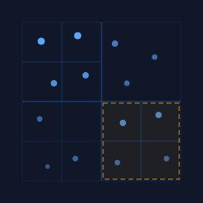

<p align="center">
  
</p>

<h1 align="center">@gridworkjs/quadtree</h1>

<p align="center">quadtree spatial index for sparse, uneven point and region data</p>

## Install

```
npm install @gridworkjs/quadtree
```

## Usage

A 2D game where entities spawn and despawn dynamically. The quadtree tracks their positions so you can efficiently query who's nearby:

```js
import { createQuadtree } from '@gridworkjs/quadtree'
import { point, rect, bounds } from '@gridworkjs/core'

const entities = createQuadtree(e => bounds(e.position))

// entities come and go at arbitrary positions
entities.insert({ name: 'player', position: point(100, 200) })
const goblin = { name: 'goblin', position: point(120, 210) }
entities.insert(goblin)
entities.insert({ name: 'chest', position: point(400, 50) })
entities.insert({ name: 'trap', position: rect(110, 190, 130, 220) })

// who's in the player's field of view?
entities.search(rect(50, 150, 200, 300))
// => [player, goblin, trap]

// what's closest to the goblin for it to target?
entities.nearest({ x: 120, y: 210 }, 3)
// => [goblin, trap, player]

// entity defeated - remove it (by reference)
entities.remove(goblin)
```

Quadtrees handle sparse, uneven data well. Entities can cluster in one corner or spread across the whole map - the tree adapts its subdivision to match.

## Options

```js
createQuadtree(accessor, {
  bounds: { minX: 0, minY: 0, maxX: 1000, maxY: 1000 }, // world bounds (optional, auto-grows)
  maxItems: 16,  // items per node before splitting
  maxDepth: 8    // maximum tree depth
})
```

If `bounds` is omitted, the tree auto-creates bounds from the first insert and grows as needed.

## API

### `createQuadtree(accessor, options?)`

Creates a new quadtree. The `accessor` function maps each item to its bounding box (`{ minX, minY, maxX, maxY }`). Use `bounds()` from `@gridworkjs/core` to convert geometries.

Returns a spatial index implementing the gridwork protocol.

### `index.insert(item)`

Adds an item to the tree.

### `index.remove(item)`

Removes an item by identity (`===`). Returns `true` if found and removed.

### `index.search(query)`

Returns all items whose bounds intersect the query. Accepts bounds objects or geometry objects (point, rect, circle).

### `index.nearest(point, k?)`

Returns the `k` nearest items to the given point, sorted by distance. Defaults to `k=1`. Accepts `{ x, y }` or a point geometry.

### `index.clear()`

Removes all items. Preserves fixed bounds if provided at construction.

### `index.size`

Number of items in the tree.

### `index.bounds`

Current root bounds, or `null` if empty and no fixed bounds were set.

## License

MIT
